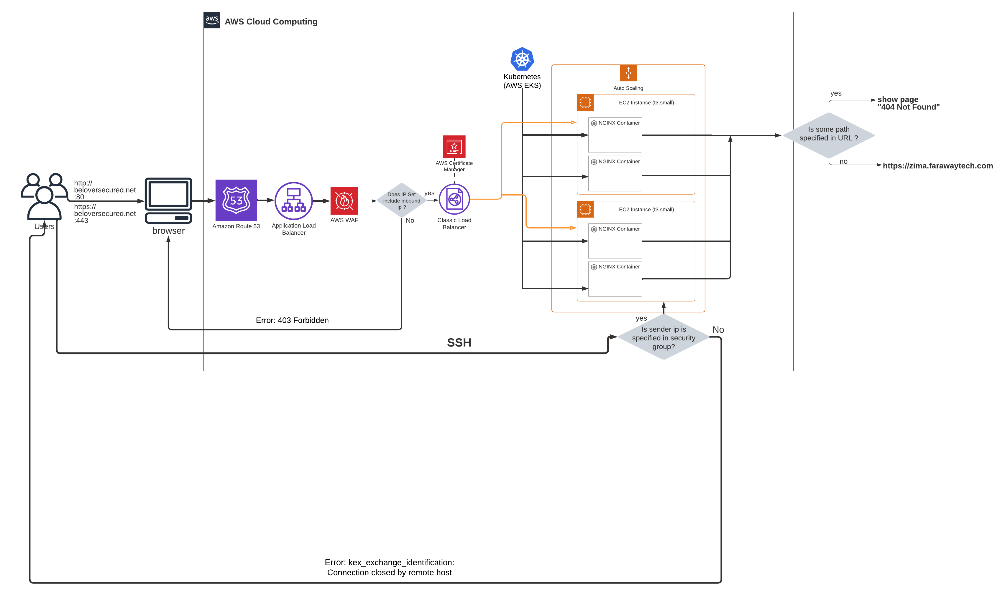

# Test task for Trainee DevOps position in [Oversecured](https://oversecured.com/) company

## The original task description (in Ukrainian):

Привіт! Завдання важке, але хто казав, шо буде легко?
:)

- Створити акаунт на AWS
- Створити двох юзерів на AWS:
- Перший - ваш, через якого ви будете працювати
- Другий - той, який ви дасте на перевірку (з мінімальними правами, але достатніми для перевірки тестового)
- Створити EC2 інстанс (використовувати безкоштовний розмір інстанс) + відкрити до нього доступ через інтернет
- На інстансі підняти NGINX, який через 80 порт віддає просту HTML сторінку

Додаткові вимоги - програма Бонус+ :)

- Змінити дефолтний шлях до вашої HTML-сторінки, наприклад http://*.compute.amazonaws.com/page
- Обмежити доступ до інстансу тільки з певного пулу протоколів (http, https, ssh)
- Обмежити доступ до інстансу тільки з певного IP і дати права нашому користувачеві додати свою IP адресу в security group самостійно.
- На сторінці виводити інформацію з будь-якого публічного API (погода, курс валют, ...) з якимось періодом оновлення даних.

Який вигляд має результат:
- Посилання на свою HTML-сторінку
- Креденшели від юзера, через якого можна зайти і подивитися всередину акаунта (EC2 консоль)

Лист з результатами чекаємо на пошті до 25 червня включно на пошту ikhorolskiy@oversecured.com

## Translated task description (in English):

Hello! The task is challenging, but who said it would be easy?
:)

- Create an AWS account
- Create two users on AWS:
- The first one - yours, through which you will be working
- The second one - the one that you will provide for checking (with minimal rights, but enough for checking the test task)
- Create an EC2 instance (use a free tier size) + open internet access to it
- Set up NGINX on the instance, which serves a simple HTML page through port 80 

  Additional requirements - Bonus+ program :)

- Change the default path to your HTML page, for example http://*.compute.amazonaws.com/page
- Limit access to the instance only from a certain pool of protocols (http, https, ssh)
- Limit access to the instance only from a certain IP and give our user the right to add his IP address to the security group independently.
- On the page, display information from any public API (weather, exchange rates, ...) with a certain data update period.

What the result looks like:

- A link to your HTML page
- Credentials from a user, through which you can log in and look inside the account (EC2 console)

We are waiting for an email with the results by June 25th inclusively at ikhorolskiy@oversecured.com

## Notes for using the results

The result is link **beloversecured.net** (domain name bought in AWS Route 53).
You can use this link either with protocol HTTP (http://beloversecured.net) on port 80
or with protocol HTTPS (https://beloversecured.net) on port 443. 
When you use protocol HTTPS you can get warnings from browser but don't pay attention to it - visit website despite of it. 

Using protocol link with protocol HTTP you can also try endpoints /crash, which crashes container and endpoint, /shutdown, which crashes
EC2 instance. It is developed with purpose for inspector to be sure that container and EC2 instances are automatically restored due to Kubernetes and Load Balancer accordindly.
(after trying to use this endpoints you can immediately go to http://beloversecured.net and it will works fine).

Also don't forget to clear browser cache during checking workability of this test task!

## Working diagram

## Some additional explanations 

Unfortunately, Classic Load Balancer doesn't filter input request at all and, moreover, it shows his own ip to instances instead of sender ip. 
So Classic Load Balancer only fits to distribute server loading. Because of this I need to use additionally Application Load Balancer in a bundle 
with AWS WAF (AWS Web Application Firewall) where I can define ip set where I define from which ip's I would handle requests. 
Speaking about SSH connection, here I connect to EC2 instances directly so I created separate security group where I defined inbound rules
for SSH connections to any EC2 instances in Auto Scaling Group.
These inbound rules in security group and ip set in AWS WAF can be edited by inspector according to task requirements.
